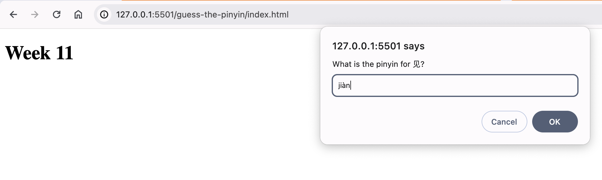
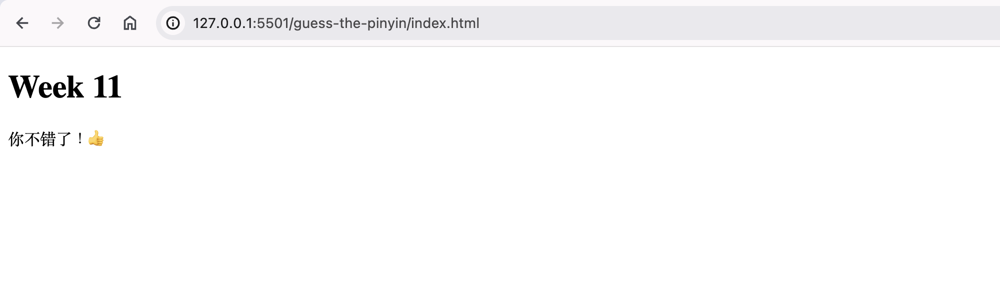

# Rust in JavaScript (JS)

## Week 10 project journaling

DevWorld conf in Amsterdam on March 1 was my first "silent disco" conference.
In the main hall the talks were attended by putting on the headphones left on the seat that were pretuned to the stages radio frequency (I assumed).
One of the silent disco talks was on Wasm and serverless, "A Greener, Cost-Effective Cloud with Serverless WebAssembly" by Sohan Maheshwar, and he made a compelling case for it (8).
I've been curious out WebAssembly (wasm) for a long time, but even after listening to talks about it and reading some articles I still couldn't wrap my head around it.
I think part of the problem for me is that WebAssembly encompasses of different concepts, and when people discuss WebAssembly what the mean can be different depending on the context.
They can mean the bytecode itself, the original project vision of running non-JS code in the browser, the new iniatives to run Wasm outside the browser.
Surrounding wasm is dizzying amount of supporting projects and tools: WASI, WABT, Wasmer, Wasmtime ... it's a lot.

The lure of idea of building web applications with native-like performance with wasm was one of my main motivations, maybe strangely, for Rust though.
I knew that wasm was being used to create the Figma application--it made a big spash in the dev world several years ago--and Rust was coming up a lot as being well-positioned for wasm development.
For this everyweek I wanted to explore this idea for myself, finally.

I started by first taking a step back, because apparently porting to wasm isn't the only way to use Rust with JS. According to Chris Biscardi (1) there are three ways:

1. Embed Rust in a JS package
2. Publish Rust binaries to NPM
3. Compile Rust to wasm

### 1. Embed Rust in a JS program

"NAPI-RS is aiming to provide a complete solution for building Node.js native addons, especially for enterprise users." (2)
Rust code is compiled to native binaries, and NAPI-rs provides the bindings for calling out to the native code from a Node application including the generation of `.d.ts` files, using the `#[napi]` macro. If I understood everything correctly, that is.
The advantage of doing this is to get a more performant Node.js application (3).
Using NAPI-rs incurs a maintainance burden at build time, but not a runtime burden.

### 2. Publish Rust binaries to NPM

This is not so much a way to use Rust within a JS program so much as _on_ one.
In situations where you have a tool built in Rust (or other) that is intended for use primarily by the broader, you may want to distribute that package where it can be conveniently used by the broadest audience: NPM.

Paraphrasing from a blog post (5), the main idea is that binaries are built for different architectures and distributed with NPM. Each NPM package is  responsible for wrapping the target-specific binary and a "base" package is exposed to the end user.

This is what Lefthook does with it's Go code, for example (4). It uses bin path in package.json to lookup the executable depending on the OS and arch. Library creators need to publish multiple optional packages for each target. It's seems a bit tedious and not entirely straighforward.

At the DevWorld conveference Ryan Dahl announced the release of [JSR](https://jsr.io/), a "superset" of the node package resgistry NPM. It will be interesting to see if binaries can be published in a similar fasion there.

### 3. Compile Rust to Wasm

Why has the Rust language has repeatedly been mentioned as great compilation to wasm story?
Because it "lacks a runtime, enabling small `.wasm` sizes because there is no extra bloat included like a garbage collector."
It's also relatively easy to do, because compiling to wasm is built into the rust compiler.
The wasm that `rustc` generates can be optimised further with `wasm-opt` (this is done automatically if you use `wasm-pack` to build the wasm lib).
With cargo we can install the crate `wasm-bindgen`, a tool that bridges JS and Rust.
It "wraps up that WebAssembly file into a module the browser can understand" (7).

1. `cargo new --lib guess-the-pinyin`
2. update TOML file specifying lib type (`cdylib`) and dependencies (`wasm-bindgen`)
3. Replace the generated code with some simple Rust code the `lib.rs` to get started.
4. Build the wasm file! `wasm-pack build --target web`.
5. Load it the wasm file! Create a simple HTML file that loads the JS module that loads the wasm file that `wasm-pack` just generated.
6. 派对！(pàiduì! a.k.a party!)

Here's the full snippet of input Rust code, modified from the previous "everyweek":

```rust
use std::collections::HashMap;
use wasm_bindgen::prelude::*;

#[wasm_bindgen]
extern "C" {
    #[wasm_bindgen(js_namespace = console)]
    fn log(s: &str);

    pub fn alert(s: &str);

    pub fn prompt(s: &str) -> String;
}

#[wasm_bindgen]
pub fn main() -> String {
    let pinyin_to_hanzi = HashMap::from([
        ("wǒ".to_string(), "我".to_string()),
        ("nǐ".to_string(), "你".to_string()),
        ("hǎo".to_string(), "好".to_string()),
        ("zài".to_string(), "再".to_string()),
        ("jiàn".to_string(), "见".to_string()),
        ("jiào".to_string(), "叫".to_string()),
        ("lǐ".to_string(), "李".to_string()),
    ]);

    let hanzi_pick = pinyin_to_hanzi.values().nth(0).unwrap();
    let input = prompt(&format!("What is the pinyin for {}?", &hanzi_pick));
    let hanzi_maybe = pinyin_to_hanzi.get(input.trim());
    let you_are_right = "你不错了！👍".to_string();
    let you_are_wrong = "你错了！👎".to_string();
    let result;

    match hanzi_maybe {
        Some(hanzi) => {
            if hanzi == hanzi_pick {
                result = you_are_right;
            } else {
                result = you_are_wrong;
            }
        }
        None => result = you_are_wrong,
    }

    return result;
}
```

and here's the full snippet HTML code using the output wasm module:

```html
<!doctype html>
<html lang="en-US">

<head>
  <meta charset="utf-8" />
</head>

<body>
  <script type="module">
    import init, { main } from "./pkg/guess_the_pinyin.js";
    init().then(() => {
      const result = main();
      document.getElementById("result").textContent = result;
    });
  </script>
  <h1>Week 11</h1>
  <p id="result"></p>
</body>

</html>
```

And wow, it really actually worked.




## Q. Stupid questions

1. ✅ How do I even execute wasm in the browser?
1. ✅ Why is Rust such a popular language for using for WebAssembly?
1. ⬜️ How is Figma using WebAssembly?
1. ⬜️ What is all that stuff in the JS module `wasm-bindgen` generated?

### How do I even execute wasm in the browser?

Starting from a very basic handwritten `wat` file, a `wasm` file can first be generated and loaded by JS.
I created a `hello.wat` file and pasted in some basic wat code.
Then I generated the bytecode `wasm` file using the `wat2wasm` tool from the WebAssembly Binary Toolkit (`wabt`).
Because it's not so obvious for basic JS developers like myself, here are the steps I took to install the `wabt` tools on my MacOS (v14.4):

  1. Git clone the repo [as instructed](https://github.com/WebAssembly/wabt?tab=readme-ov-file#cloning).
  2. Install `cmake` with brew, `$ brew install cmake`, and restart the old terminal to check the installation, `$ cmake --version`.
  3. Build the executable [as instructed](https://github.com/WebAssembly/wabt?tab=readme-ov-file#building-using-cmake-directly-linux-and-macos).
  4. Add the folder to your PATH, e.g. to my `.zshrc` I added `export PATH="/path/to/wabt/build/:$PATH"`, then applied the changes to terminal, `$ source ~/.zshrc ` (or you can restart again).
  5. Then `$ wat2wasm hello.wat` created `wat2wasm hello.wasm`. Great success.

To run `hello.wasm` in the browser, the wasm file needed to be loaded by JS, the JS needed to be bootstrapped by HTML, and the HTML needed served from a server and not just the local filesystem. (The [Live Server](https://marketplace.visualstudio.com/items?itemName=ritwickdey.LiveServer) VSCode extension was nice for this because is has live reloading.) After all of that, I did manage to log out (and then contemplate) the meaning of life to console. Great success.

### Why is Rust such a popular language for using for WebAssembly?

"For the third year running, Rust is the most frequently used language for WebAssembly. Rust has always been a good fit for WebAssembly; it is a modern system-level language that has broad popularity (the Stack Overflow revealed it is the most desired language seven years in a row), it also happens to be a popular language for authoring WebAssembly runtimes and platforms." (6)

## References

1. [Why is the JS ecosystem switching to Rust?](https://www.youtube.com/watch?v=dZQMoEWe5uY)
2. [NAPI-RS](https://napi.rs/)
3. [Node & Rust: Friendship Forever. The NAPI-rs Way.](https://dev.to/valorsoftware/node-rust-friendship-forever-the-napi-rs-way-1kb8)
4. [Lefthook: The fastest polyglot Git hooks manager out there](https://github.com/evilmartians/lefthook/blob/master/packaging/npm/lefthook/package.json)
5. [Packaging Rust Applications for the NPM Registry](https://blog.orhun.dev/packaging-rust-for-npm/)
6. [The State of WebAssembly 2023](https://blog.scottlogic.com/2023/10/18/the-state-of-webassembly-2023.html)
7. [Compiling from Rust to WebAssembly](https://developer.mozilla.org/en-US/docs/WebAssembly/Rust_to_wasm)
8. This isn't the talk from DevWorld, but is the same take he gave at another conference, [A Greener, Cost-Effective Cloud with Serverless WebAssembly](https://www.youtube.com/watch?v=QVfKt7aIZO8)
