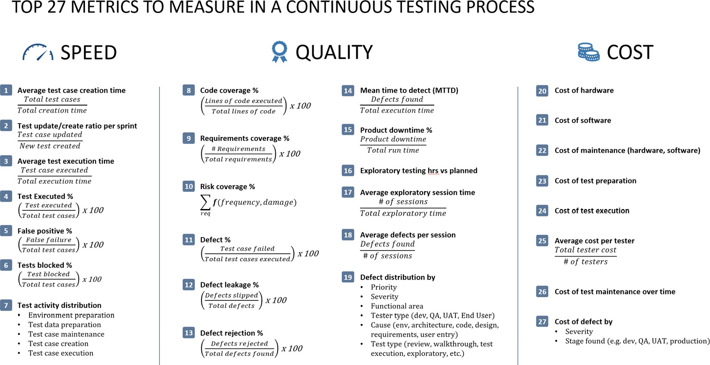

# Testing

## Learning plan

- [] https://github.com/kentcdodds/react-testing-library-course
- [] QA Wolf
- [] Vitest
- [] MSW
- [] Storybook component testing
- [] Playwright 

## Introduction

People don't test because they don't know how--because the codebase hasn't been designed to be testable. If you've made an untestable codebase it is likely so tightly coupled that it is immediately a legacy codebase because you're unwilling to make changes to it. Outcomes of good test coverage:

- **confidence to refactor**: as the code grows or in a codebase that's not yours without tests you might not risk refactoring to fix an issue and implement some hack instead, which makes the overall problem worse.
- **document the code**: better than documentation--it's verifiable. Assertions about what shoul dbe true about the system are codified in a test. It's a form of communication for new developers _and_ you're future self. Tests are example of how things should work that allow you to generalise about how the system works.
- **develop faster**: It is _critical_ that writing and running tests be easier than the application so you can narrowly focus on a problem instead of getting the application into a state to validate the change.
- **improve AI output**

## Kinds of tests by category

The main web application testing types consist of functional, non-functional (performance, security, accessibility), APIs, visual, and so on.

- testing level: static analysis, unit, integration (functional), system (e2e), acceptance
- functionality: function, performance, security, usability, accessibility
- automation: manual, automated
- other: regression, smoke

## Designing a testing strategy

Building a testing strategy for a given web application depends on 
- the product requirements,
- the quality acceptance criteria,
- the available skills and resources within the team, and
- the target markets (end users) for which the application is intended.

Make test data and test environments for both the development stages and testing stages part of the project plan and become available prior to initiating the testing process.

### What is the testing scope?
The type of tests to focus on right now and covered in this document

- [x] Functional testing
- [ ] Accessibility testing
- [ ] Static code analysis - eventually we could setup sonarqube
- [ ] Performance testing
- [x] Authn/z security testing
- [ ] OWASP top 10 - where possible but obviously not all the top 10 is addressable from cradle/web
- [ ] Mobile testing
- [ ] Desktop testing - not included because we won’t tests across different desktop browsers, but we will be testing in some desktop browser.
- [ ] API testing - the API is not explicitly tested, but some parts will be tested implicitly via e2e tests
- [x] UI component testing - with Storybook
- [x] Visual testing
- [ ] Usability testing - open to ideas for testing this with automation in future

### What testing metrics matter?



Metrics that are commonly used to monitor application testing (2). For example, the following proposal for web “test vitals”:
- (Speed) Total execution time: How long do tests take to run? Is it below a certain threshold? Relevant when test execution impacts developer velocity, such as blocking merge, or commit.
- (Quality) Defect leakage: How many bugs are making it into production? Relevant when test execution doesn’t impact developer velocity, e.g. long running tests that are executed nightly
- (Speed, Quality) Mean Time to Detect (MTTD): The time it takes to identify a defect in the code based on the total test execution time. Obviously, the shorter it takes to uncover a defect and then resolve it, the better. It also reflects the effectiveness of the test code. 
- (Quality) Total defects and defects by priority: Pull these numbers from linear. Similar to core web vitals, the usefulness comes from setting thresholds, e.g. fair, poor. Knowing the volume of defects and the priority attributed to each helps to determine the quality plans and future testing scope.
- (Quality) Risk coverage percent (?)
- (Cost) Cost of test maintenance: Open to ideas on how to measure this, but it’s important to track. When tests are flaky, hard to debug, or hard to fix, trust in them drops, people start skipping them or ignoring failing tests when they shouldn’t. Maybe something defect rejection is easier. A measure of false positives, tests skipped/ignored.


## Testing with Vitest

### Faster test execution

- threads and thread pooling
- test filtering
- concurrent execution

### Metric reporting

- Instanbul for coverage reports

### Built-in test features

- Chai assertion library
- Tinyspy for spies
- Happy-dom or jsdom support (not built-in)
- Tinybench for peformance benchmarks (experimental)
- Expect-type for type assertions

#### Browser mode

JSDom is a spec implementation of the DOM that simulates a browser environment. JSDOM simplifies the test setup and provides an easy-to-use API, it's good simulation but a simulation none-the-less, which can mean false positives and negatives. IT does mean longer initialisation time though. Vitest's browser mode is early development, augmenting with a standalone browser-side test runner, e.g. Playwright, is recommended.

In vitest, conventional Node-based tests can be configured along-side browser tests with project configuration. Browser tests can be run in preview mode, which opens a browser and headless mode, which executes the tests in the background without the browser UI.

## Testing with React Query

Components using React query will require a Query client provider. A `renderWithClient` util can be created for this purpose. A new query client should be created for each test with settings suitable for test, e.g. no retries.

```js
function renderWithClient(ui) {
  const testQueryClient = new QueryClient();

  return render(
    <QueryClientProvider client={testQueryClient}>
      {ui}
    </QueryClientProvider>
  );
}
```

Pair it with MSW to simulate API requests, and run the server before the test suite

```js
// Establish API mocking before all tests.
beforeAll(() => server.listen());
// Reset any request handlers that we may add during the tests, so they don't affect other tests.
afterEach(() => server.resetHandlers());
// Clean up after the tests are finished.
afterAll(() => server.close());
```

A challenge when testing mutations that invalidate queries is that static mock handlers don't reflect changes from mutations. Even after a mutation is performed and a query is invalidated, the mock handler will still return the same initial data. The problem of static mock handlers not reflecting mutation changes can be solved by using MSW's one-time override feature, `res.once`, which allows dynamic updates the mock response for a specific request, simulating the updated state after a mutation.

## Testing with Storybook

## Testing with Playwright

## References

- <https://frontendmasters.com/courses/web-app-testing/introduction/>
- [Unit Testing Principles, Practices, and Patterns](https://learning-oreilly-com.onlineresources.tpl.ca/library/view/unit-testing-principles/9781617296277/Text/kindle_split_010.html)
- [GenAI for QA](https://learning-oreilly-com.onlineresources.tpl.ca/course/genai-for-qa/9781806709939/)
- [Practical Playwright Test: Next-Generation Web Testing and Automation](https://learning-oreilly-com.onlineresources.tpl.ca/library/view/practical-playwright-test/9798868821608/)
- [Full Stack Testing, 2nd Edition](https://learning-oreilly-com.onlineresources.tpl.ca/library/view/full-stack-testing/9798341636934/)
- [Software Testing Strategies](https://learning-oreilly-com.onlineresources.tpl.ca/library/view/software-testing-strategies/9781837638024/)
- [Testing JavaScript Applications](https://learning-oreilly-com.onlineresources.tpl.ca/library/view/testing-javascript-applications/9781617297915/) <https://learning-oreilly-com.onlineresources.tpl.ca/videos/testing-javascript-applications/9781617297915AU/>
- [A Frontend Web Developer's Guide to Testing](https://learning-oreilly-com.onlineresources.tpl.ca/library/view/a-frontend-web/9781803238319/)
  - [ ] Chapter 6: Map the Pillars of a Dev Testing Strategy for Web Applications
- [Vitest](https://vitest.dev/guide/)
- [Unit testing with Vitest](https://www.youtube.com/watch?v=9Op6lK4wnRE)