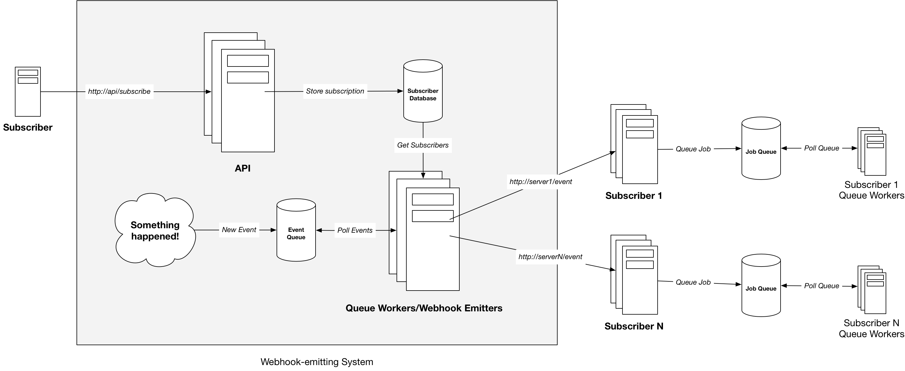

# Webhooks

**A webhook is a way to push updates to subcribers over HTTP.**

> The Webhook is the Web's way to integrate completely different systems in semi-real time. ... HTTP, the protocol used for requesting and fetching website[s] ... has become the default delivery mechanism for almost anything that's transferred over the Internet.

The difference between a website and a webhook is that the sender is not a browser, but some sort of automated system, and data sent is some data, not specifically the page to be sent back.

Webhooks have a straightforward flow:

0. A subscriber subscribes to a .
1. Something happens (!) and an event is pushed to a queue.
2. A queue worker reads from the queue and fetches the list of subscribers for that event
3. A HTTP request is made to each subscriber
4. Each subscriber responds and queues a response action.

Webhooks remove the inefficiency and latency of polling. Instead of polling an endpoint to see if there is an update, the update is sent in "semi-real time".

> But what if a regular API, where I contact it myself and receive the data at my leisure, isn't enough? What if I don't want to constantly ping the API for data – what if it could just let me know when something changes? As that became a growing need, the word for applications exchanging information automatically like this came to be known as a Webhook. Something happened? Ping my Webhook and I'll know!

## References

1. <https://simonfredsted.com/1583>
2. For testing webhooks before you build if you don't already have a cloud provider, <https://webhook.site/#!/view/d198453e-2e53-4bf9-bbc4-57c774fea989>
3. <https://medium.com/@jsneedles/your-webhooks-endpoint-should-do-almost-nothing-d246378a85e5>