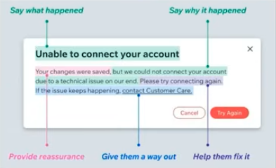

# Error handling

The impact of an error depends on the JavaScript runtime environment: an uncaught exception can crash a single-page application, or terminate a Node.js process. In JavaScript, errors propagate through the call stack until they’re either caught by a try/catch block or reach the global scope, this is known as "bubbling".

Error bubbling can be both useful and risky. On one hand, it allows you to catch errors centrally, letting outer layers handle error management—such as displaying user-friendly messages or logging detailed stack traces. On the other hand, an uncaught error can propagate further than intended, reaching users or crashing critical systems unexpectedly.

The general pattern for errors in JS is,

1. Catch the error
2. Log the error, e.g. to console or a logging service
3. Show the user/client an error message

> The fundamental tools JavaScript gives us for handling errors are the `try...catch` statement, the `throw` keyword and the `Error` object.

JavaScript lets you throw anything. Not just Error objects – you can throw a string, a number, an object, you name it. As a result, a catch (err) in JS has to be prepared for anything – an Error, a string, even undefined. TypeScript requires that a caught error be typed as any or unknown because it can’t know the type of thrown errors ahead of time. However, it’s generally considered bad practice to throw non-Error values, since throwing plain strings means no stack trace or no consistent message.

## Options for handling errors in JS

1. Just use `try...catch` and an adapter. It's the developer's responsibility to ensure that the error is properly handled and transformed into a user-friendly message.
2. Use a library like `neverthrow`, which provides a Rust-inspired Result type for TypeScript. The function always returns an object with a value or error. Error handling is enforced.
3. Effect is a full-fledged functional effect system for TypeScript, the key idea with Effect is that your computations become descriptions of what to do, including how to handle errors, and the library’s runtime ensures that errors are tracked and handled in a principled way. Because the error type is in the signature, the TypeScript compiler knows exactly which errors can happen and will make you handle them. It's closer to adopting a “new programming language” inside TypeScript than just npm installing a library.

## Exception handling tips

Upgrade error handling UX, DX. It will tedious and verbose but you're future users and self with thank you.

- measure rate of reported issues, debugging time to validate value
- try neverthrow and tagged errors
- validate and parse data at the boundaries before they get into the system (standard schema)
- use (React) error boundaries are for exceptional circumstances only, "real" deffects and handle predictable errors granularly within components
- be specific with error types and enrich them with data and context
- provide feedback to the user about errors following a convention
- for SWR or Tanstack query return the error type in the data channel
- configured Sentry to expose these errors in the logs: 
    - React Error Boundaries have been available with React 16 can provide component stack traces
    - Two new hooks in React 19, onCaughtError and onUncaughtError can also send reports to Sentry with component stack traces (except for Next.js)

## Resources

- [On JavaScript Errors](https://www.haydenbleasel.com/blog/on-javascript-errors?utm_source=ECMAScript.news&utm_medium=Weekly+Newsletter&utm_campaign=2025-06-04)
- [Throw Try/Catch in the 🗑️ Level up your React error handling with the Result type - Dillon Mulroy](https://www.youtube.com/watch?v=VcOIz7tOBoM&list=WL&index=20)
