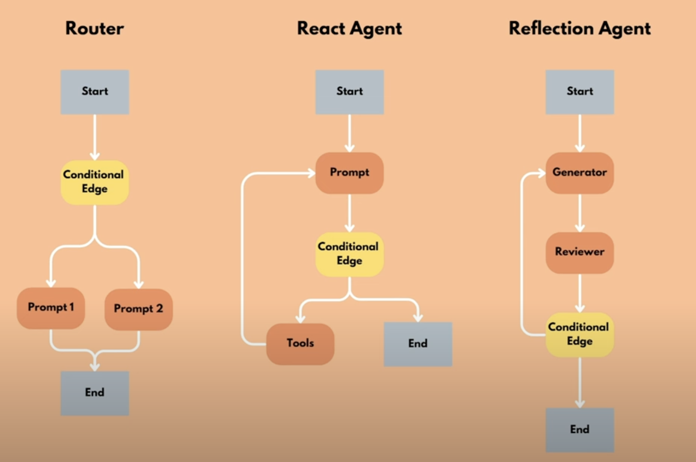

# LangGraph

LangGraph is a low-level orchestration framework for building, managing, and deploying long-running, stateful agents.

Elements of LangGraph:

- **State**: The current state of the agent, which can be updated as the agent processes tasks. It is shared, e.g. a meeting whiteboard where every participant (node) can read and write. It is a knowledge source and communication channel to coordinate agents.
- **Nodes**: The individual operations that perform specific tasks in the graph. They typically take the state as an input, process it, and produce and output or update the state.

Agent patterns:

- router
- react agent
- reflection agent

