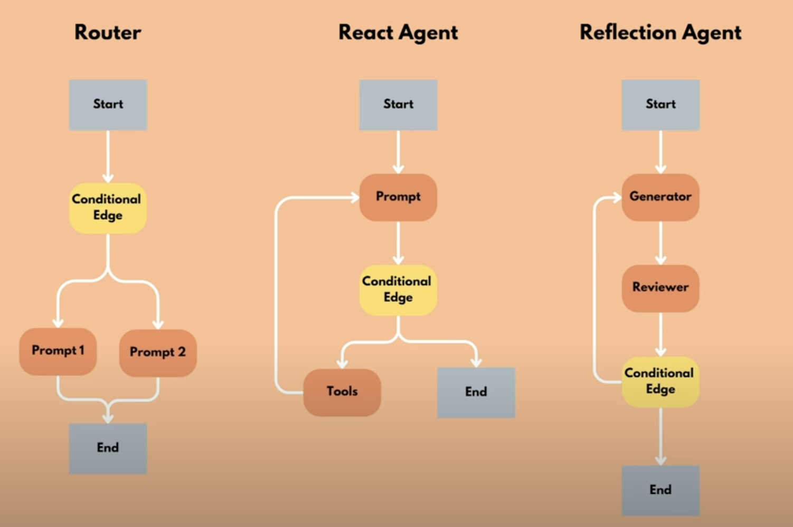

# LangGraph

LangGraph is a low-level orchestration framework for building, managing, and deploying long-running, stateful agents.

Elements of LangGraph:

- **State**: The _current_ state of the agent, which can be updated as the agent processes tasks. It is a knowledge source and communication channel to coordinate agents. It is like a meeting whiteboard where every participant (node) can read and write.
- **Nodes**: Individual operations that perform specific tasks in the graph. They typically take the state as an input, process it, and update the state or provide an output. Nodes are connected to form an assembly line of operations.
- **Graph**: The overarching structure connecting nodes, like a roadmap connecting cities (nodes) with highways (edges).
- **Edges**: Determine the flow of execution, like train tracks, with the train carrying the state that gets updated as the train moves from one station to another. There are normal and condition edges, that decide the next node to be executed.

Agent patterns:

- router
- react agent
- reflection agent

