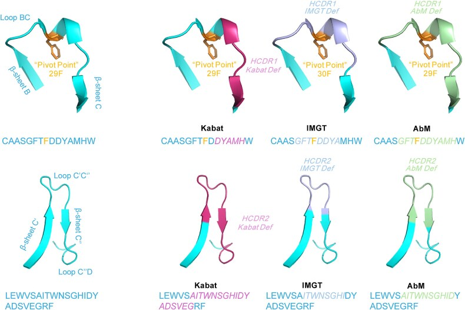

# Antibody numbering

There are quite a few schemes

- Kabat (sequence-based): based on sequence variability and is the most commonly used
- Chothia (structure-based): ased on the location of the structural loop regions
- AbM: a compromise between
- IMGT
- AHo (structure-based)
- Gelfand (structure-based)
- Wolfguy
- Contact (structure-based): based on an analysis of the available complex crystal structures
- Martin (structure-based)

Protein numbering in antibodies is a "MSA with opinions": different communities fixed a canonical alignment and then froze it into named positions (Kabat, IMGT, Chothia, AHo, …), plus some hacks like insertion letters, so that everyone can talk about “H52a” or “IMGT 111” unambiguously (1).

"Antibody numbering is a way to sidestep MSAs." For non-antibody proteins to tell if a region is conserved or not, a lot of sequences are taken and aligned. Because antibody sequences are similar, it is possible to precompute their MSA, in a way.

The CDR definitions in these antibodies are quite different to each other.

## Why antibody numbering exists at all

Antibody variable domains are homologous but differ in length because of V(D)J recombination, junctional diversity, and somatic hypermutation (SHM), especially in CDRs (2).

To compare them, sequences are aligned and then each column is assigned a “canonical coordinate” so that structurally equivalent positions share a number, even if some sequences have extra residues (1).

The numbering schemes leverage the distinct frequencies of amino acids observed in the conserved framework regions and the CDRs of antibodies to define the CDRs (1).

By aligning the amino acid sequence of the target antibody with a specific numbering scheme, it becomes possible to determine a residue’s location within the three-dimensional structure and classify it as part of the framework or CDR regions.

Different groups did this alignment/coordinate-defining step in different ways, giving rise to schemes like Kabat, IMGT, Chothia, Martin (AbM), and AHo(3). 

In general, the development of different antibody numbering schemes can be categorized into two approaches: sequence-based and structure-based.

## Core antibody numbering schemes

Each scheme is a different answer to: “How do we define coordinates and CDR boundaries on an aligned variable domain?” (1).

### Kabat (1977)

- widely used
- sequence-based numbering system: CDRs defined by AA variability peaks not by 3D structure (2).
- Insertions: specific positions where extra residues are allowed, annotated as letters, e.g. 27A, 27B, 100A–100H (3).
- Heavy and light chains have independent number spaces: H100 is not structurally equivalent to L100 (3).

The Kabat antibody numbering system, developed by Kabat and Wu in 1977, was the first one to be introduced.

The Kabat numbering scheme was developed at a time when immunoglobulin structural information was limited or unavailable, so it based primarily on the sequential order of amino acids (1).

Consequently, the Kabat system is a sequence based approach, relying on the analysis of amino acid sequences to determine CDR and FR boundaries.

Kabat and Wu aligned the sequences of "77 Bence-Jones proteins" (immunoglobulin light chains) and indentified the conserved regions (FRs) and high variable regions (CDRs).

Variations in length are accommodated by placing indels, insertion/deletion points (1).

In the numbering scheme insertions are denoted by letters in the numbering scheme (e.g. 27a).

Since the numbering scheme was developed from a fairly limited set of sequence data, the positions at which insertions occur in CDR-L1 and CDR-H1 do not match the structural insertion position. Thus topologically equivalent residues in these loops do not get the same number.

Also, the numbering adopts a rigid specification. For example in the potentially very long CDR-H3, insertions are numbered between residue H100 and H101 with letters up to K (i.e. H100, H100A ... H100K, H101) ().

Because Kabat’s positions and CDRs replies on AA frequencies, they’re not inherently “structural”, and that sometimes leads to misalignment with real loop geometry (4), and in the definition of wider CDRs compared to other numbering schemes (1).

### IMGT (1997)

Marie-Paule Lefranc introduced the IMGT unique numbering system with the aim of simplifying the comparison of immunoglobulin (IG) and T cell receptor (TR) sequences, as well as major histocompatibility complex (MHC) and related proteins of the immune system (RPI) sequences, across human and other vertebrate species (1).

- IMGT defined a “unique numbering” by aligning germline V genes and then extending across the whole variable domain (5). 
- Continuous numbering from 1 to 128/129 for the V-domain, with exactly defined FR-IMGT and CDR-IMGT regions (6). 
- Only one insertion locus for long CDR3: between positions 111 and 112; extra residues are symmetrically distributed around those positions (e.g. 111A, 111B before 111, and 112A, 112B after 112 in some implementations) (3).

Hidden depth: IMGT is trying to have a single “structurally corresponding” index for all antigen receptors (Ig/TCR), so the scheme is global and conservative with insertions; this is why IMGT is popular in immunoinformatics where cross-locus comparisons matter (7). 

### Chothia 

The Chothia numbering scheme is identical to the Kabat scheme, but places the insertions in CDR-L1 and CDR-H1 at the structurally correct positions. This means that topologically equivalent residues in these loops do get the same label (unlike the Kabat scheme).

The only differences between the Chothia and Kabat numbering schemes are in the sites of indels in CDR-L1 and CDR-H1.

- Structure-based: Chothia & Lesk used crystal structures to define CDRs and canonical loop classes; numbering is tied to structural landmarks (1).
- Still uses insertion letters; differs from Kabat mainly in where insertions in CDRH1 and neighboring FR positions are placed (2).
- Martin (“enhanced Chothia”) tweaks some insertion placements relative to Chothia to better match structural data (3).

Hidden depth: Chothia vs Kabat often disagree on CDR boundaries (e.g. especially CDR-H1 and H2), because one is variability-based, the other structural; this matters if you’re doing sequence-only workflows but talking to structural biologists (4).

### AHo and others

- AHo defines 149 possible positions for all antigen receptor types, trying to avoid explicit insertion letters by providing many “spare” coordinates (3).
- Other schemes (e.g. “Wolfguy”) similarly define large coordinate grids to embed most natural sequences without insert codes (3).

Hidden depth: these newer schemes essentially pre-allocate more coordinate space up front to linearize what would otherwise need letter insertions; you can think of it as designing a “reference MSA” with lots of empty columns (3).

## Comparing and constrasting the different numbering systems

Discrepancies among various numbering schemes has lead to confusion.
The differences can be contrasted by comparing
- The coordinate labels (numbers and letters) used by each scheme.
- The CDR boundaries (which numbered residues are considered CDR).
- How they treat insertions (lettered positions vs skipped numbers).

## How numbering and MSA interplay

Conceptually, there are two paths:

1. Classical MSA-first:
   - Align sequences (Needleman–Wunsch/Clustal/MAFFT) based purely on sequence similarity (8). 
   - Then map alignment columns to a numbering scheme (e.g. “column 42 is Kabat 31”, etc.) (9). 
2. Numbering-guided alignment (antibody-specific tools):
   - Use predefined motif anchors (e.g. conservative residues, J-region motifs, constant cysteines, etc.) and scheme rules to assign numbers directly from sequence (1).
   - Perform MSA not by purely optimizing scoring but by aligning residues to their canonical numbers; Abalign is an example (9).

Hidden depth: in antibody land, “MSA” is often replaced by “number each sequence independently, then align by sorting on their number labels”, which yields structurally meaningful columns without a classic guide-tree MSA (1).

## Insertion codes and gaps: the subtle bits

Numbering has to handle two sources of length variability:

- Germline differences (e.g. different V genes with slightly different FR lengths, 5).
- Junctional/CDR insertions (especially CDR-H3) and somatic indels (2).

Different schemes handle these differently:

- Kabat/Chothia/Martin:
  - Maintain a “mainline” of integers, with insertions encoded as letters between integers, e.g. 27, 27A, 27B, 28; or H100A–H100H region. (3)
  - MSA-style: those lettered residues are extra columns; sequences without them effectively have gaps at those coordinates.  

- IMGT:
  - Keeps strictly monotonic integer numbering; allows insertions only at 111–112 (CDR3) (5).
  - Extra residues in CDR3 get distributed around that locus; frameworks are more rigid (3).

- AHo:
  - Avoids per-sequence insertion labels by having a larger universal index space, so natural antibodies tend not to require insertion letters at all (3).

From an alignment perspective, numbering is just a way of labeling each gap/residue column with a stable coordinate so that when you form a multiple alignment, gaps align at consistent “numbers” across sequences.

## CDR definitions vs numbering

Another layer of complexity: CDR definitions (what is “CDR1/2/3”) are not identical to numbering schemes, but they are related (2). For example, the common CDR definitions:

- Kabat: CDRs are based on variability windows and are often longer than others (1).
- Chothia: CDRs have structural loop-based boundaries (1).
- IMGT CDR-IMGT: codified regions in the IMGT unique numbering (5).

Hidden depth: the same residue might be “CDR” in Kabat but “framework” in IMGT; this matters for things like “CDR grafting” or “liability” annotations depending on whose pipeline you plug into (4).

## Antibody numbering tools

- ANARCI: free and academic, widely used library that takes a sequence, classifies the chain (Ig/TCR), and returns numbering in multiple schemes (IMGT, Kabat, Chothia, Martin, AHo, etc.) (3).
- Antpack
- RIOT
- Online numbering tools (PipeBio, NovoPro, etc.) expose this via UIs; they present the multiple schemes side by side (2).
- Tools like Abalign perform MSA by using these numbering rules as constraints (9). IMGT’s own platform and associated papers codify the IMGT numbering and FR/CDR boundaries, which many databases adopt (5).

## References

1. [pmc.ncbi.nlm.nih](https://pmc.ncbi.nlm.nih.gov/articles/PMC11997657/)
2. [pipebio](https://pipebio.com/blog/antibody-numbering)
3. [novoprolabs](https://www.novoprolabs.com/tools/ab-numbering)
4. [mabnus](https://www.mabnus.com/News-Trend/Key-differences-and-limitations-of-antibody-numbering-schemes.html)
5. [imgt](https://www.imgt.org/textes/PDF/DCI/27_55-77_2003.pdf)
6. [frontiersin](https://www.frontiersin.org/journals/immunology/articles/10.3389/fimmu.2018.02278/full)
7. [pmc.ncbi.nlm.nih](https://pmc.ncbi.nlm.nih.gov/articles/PMC6640715/)
8. [biopython](https://biopython.org/docs/dev/Tutorial/chapter_align.html)
9. [academic.oup](https://academic.oup.com/nar/article/51/W1/W17/7173809)
10. [Antibody Numbering Schemes](https://www.youtube.com/watch?v=8QLqX1_NJ9A)
11. [Antibody Information](http://www.bioinf.org.uk/abs/info.html)

## Presentation notes

- Anchor presentation it to history (3D structures not available when Kabat was created) for memorability
- Conclude by live demonstration contrasting numbering IRL